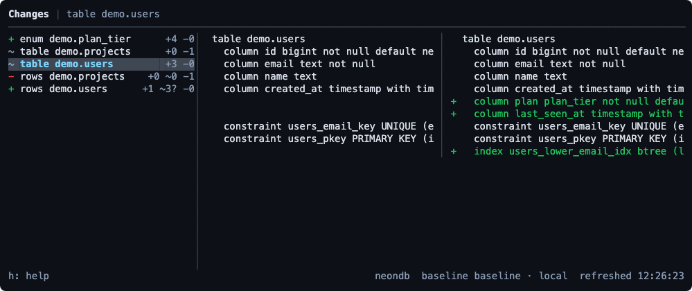

# diffium-db

diffium-db is a TUI that shows you what is changing in your database — structure
and rows — while an agent, a migration, or anyone else works. It is the database
half of [diffium](https://github.com/kubeden/diffium): same idea, same shape, one
pane of what changed and one pane of the change itself.

You point it at a database, take a baseline, and leave it open. Everything that
happens after that shows up on the left as it happens.

## Dependencies

bun: >= 1.3.0
a postgres to watch

    brew install oven-sh/bun/bun

## Stage 1 (WIP)

Watcher TUI that lists changed objects on the left and a side-by-side diff on
the right, re-capturing every second.

### Run

    bun install
    export DATABASE_URL=postgres://…

    bun run src/index.ts snapshot     # take a baseline
    bun run src/index.ts watch        # open the TUI

- `-u, --url` to point at another database, or set `DATABASE_URL`
- `--schema <name>` to watch one schema, repeatable; the default is every
  non-system schema in the database
- `--root <path>` to put `.diffium-db/` somewhere other than the current
  directory

### Keys

- `j/k` or arrow keys: move selection
- `J/K`, `PgDn/PgUp`: scroll the diff
- `{/}`: horizontal scroll in the diff pane
- `s`: toggle side-by-side vs inline
- `w`: toggle line wrap in the diff pane
- `<`/`>` or `H`/`L`: adjust left pane width
- `g/G`: first/last change
- `r`: capture now (auto-capture runs every second)
- `b`: re-baseline from the current state, after a confirmation
- `e`: write the current diff to `.diffium-db/diff-<time>.txt`
- `h`: help panel
- `q`: quit

The top bar shows `Changes | <object>` with a horizontal rule below. The bottom
bar shows `h: help` on the left and the database, the baseline and the last
capture time on the right.

That screenshot is the real thing, taken headless by `scripts/shot.ts` from the
demo below. `docs/shots/captured-diff.txt` is what `e` wrote at the same moment.

## Quick Demo

Two terminals and about a minute. `examples/demo/` sets up a `demo` schema and
then changes it the way an agent would.

    psql "$DATABASE_URL" -f examples/demo/01-baseline.sql
    bun run src/index.ts snapshot --schema demo
    bun run src/index.ts watch --schema demo

Then, in the other terminal:

    psql "$DATABASE_URL" -f examples/demo/02-agent-change.sql

Five changes appear: a new enum, two new columns and a new index on
`demo.users`, an index gone from `demo.projects`, a row inserted and a row
deleted. Press `j`/`k` to walk them, `s` to switch the diff style, `e` to write
the whole thing to a file.

## Commands

    diffium-db watch        Open the TUI and watch for changes
    diffium-db snapshot     Capture the database as a baseline
    diffium-db diff         Print the changes since the baseline and exit
    diffium-db baselines    List stored baselines

`diff --exit-code` returns 1 when anything changed, which is enough to fail a CI
job or stop an agent's loop. `diff --json` gives you the same thing structured.

## What it watches

Structure: tables (columns, defaults, identity, constraints, indexes,
triggers), views, materialized views, enums and functions. Every object is
rendered to canonical text with a stable line order, so adding a column is one
added line rather than a rewritten table.

Rows: a count for every table, and for tables with a primary key under
`--row-limit` (5000 by default), a per-row fingerprint. That is what tells an
insert from an update from a delete. Tables without a primary key, and tables
over the limit, are counted and nothing more — the diff says which.

One honest limitation: a row is fingerprinted over its whole record, so when a
table gains or loses a column every row reads as edited. Inserts and deletes are
still exact, because those come from the primary key. The diff marks the table
and says so rather than claiming edits nobody made.

## Where baselines live

- `--store local` (the default) keeps them as JSON under
  `.diffium-db/snapshots/`. No setup, and readable enough to commit next to the
  migrations that produced them.
- `--store neon --store-url <url>` keeps them in Postgres, in a `diffium_db`
  schema, so a team or a CI job can share one baseline. Built against
  [Neon](https://neon.tech), but it is ordinary SQL and any Postgres will do.
  diffium-db never watches its own schema, so the store url and the watched url
  can be the same database.

## Theming

Repo-local theming via `.diffium-db/theme.json`, relative to `--root`:

    {
      "addColor": "#22c55e",
      "delColor": "#ef4444",
      "dividerColor": "#3f4753"
    }

Hex only. Omitted fields keep their defaults. `selectedColor`, `metaColor`,
`textColor` and `panelColor` are the rest.

`.diffium-db/prefs.json` remembers the pane width and the diff style between
runs.

## ORMs

v1 tells you a column appeared. It cannot tell you which migration or which
model file put it there — that mapping is an ORM's business, and it is v2. The
seam is in `src/orms/`, documented and deliberately empty. See `ORMS.md`.

## Built with

[OpenTUI](https://github.com/anomalyco/opentui) for the terminal, Bun's built-in
SQL client for Postgres. That is the whole dependency list.
